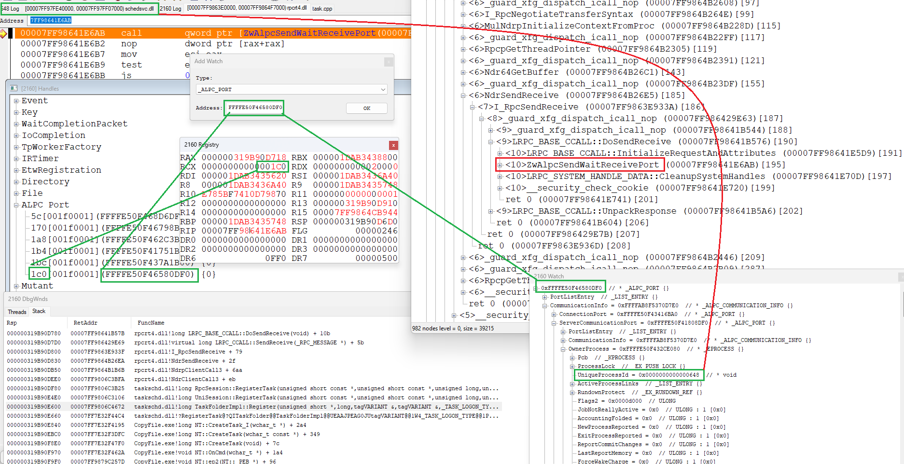
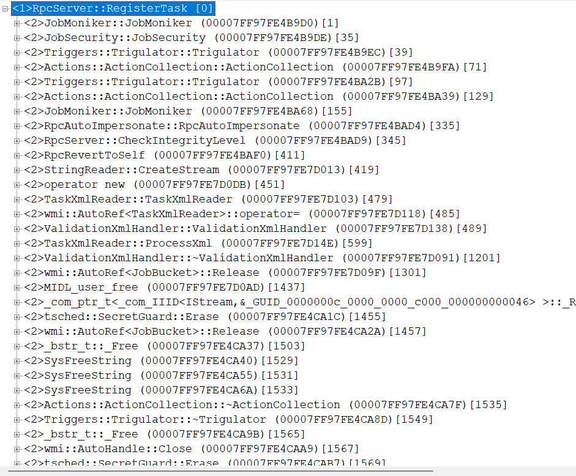
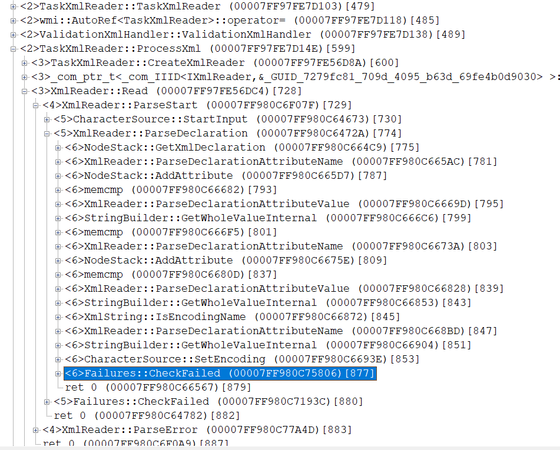
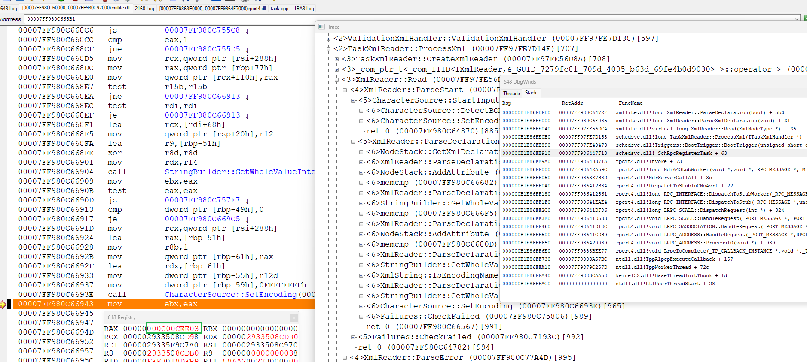

one example of debugging.
recently i try register new task in task scheduler.
with `ITaskFolder::RegisterTask`
but i got error `8004131A`

if look in `winerror.h` , this is

```
//
// The task XML is malformed.
//
#define SCHED_E_MALFORMEDXML             _HRESULT_TYPEDEF_(0x8004131AL)
```

ok. this is clear. but where is exactly error ? how detect it. xml was look like correct..
i trace call under debugger. 


and i view that actually here RPC (via LPC) call to remote process.
to which process ? in a specific case we can guess ... but I will show the general method. I put bp at `ZwAlpcSendWaitReceivePort`
look at hPort (it in rcx) value - 1C0
i look this HANDLE pointer, and i know that it point to ALPC_PORT object
so i add watch window for look memory of this object and it owner server process
this is 648 id



i look for 648 process command line
it is 
```
C:\WINDOWS\system32\svchost.exe -k netsvcs -p -s Schedule
```
ok , we can guess Schedule svchost from begin of course
begin debug this process, set bp on `rpcrt4.Invoke` for view how remote call in executed here
again trace call and view that look like CharacterSource::SetEncoding look like fail




next i call fail api ( ITaskFolder::RegisterTask) again, but now set bp after call SetEncoding
and i view that `0xC00CEE03` is returned



i search this vale in sdk headers and found in `xmllite.idl` 
in `enum XmlError`
```
MX_E_ENCODINGSWITCH,            // 0xC00CEE03 unable to switch the encoding
```
after this found what is wrong in my xml was not very hard (was encoding="UTF-8" in file, whe i pass it as UTF-16)
